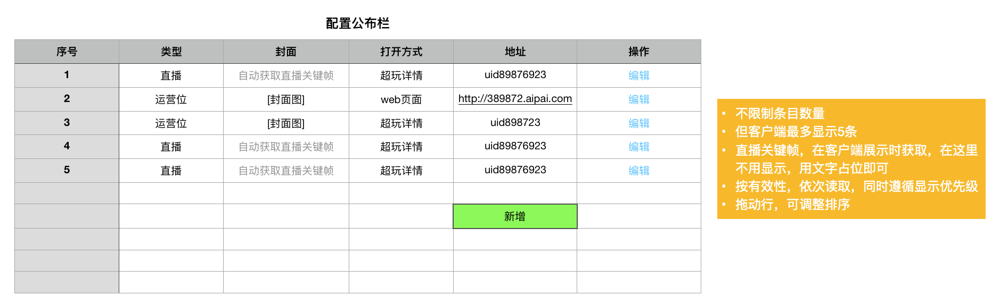
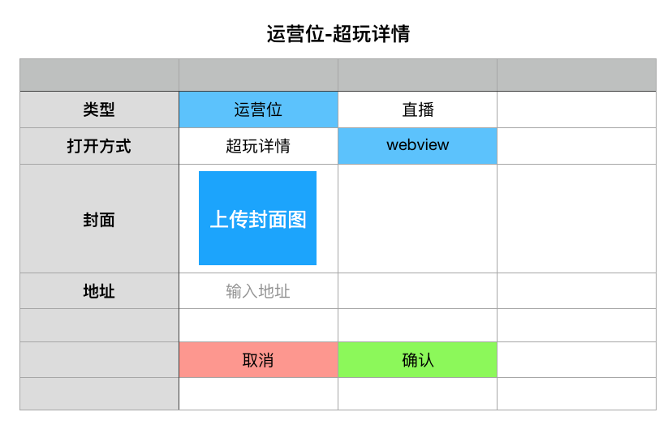
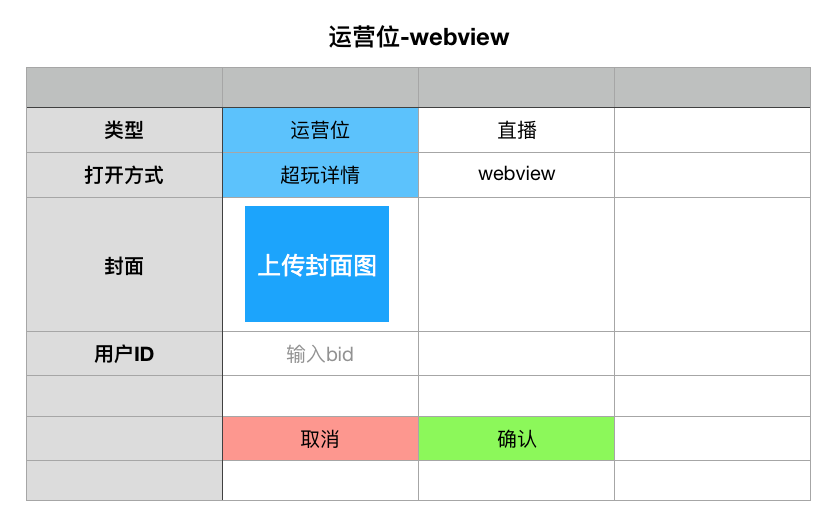
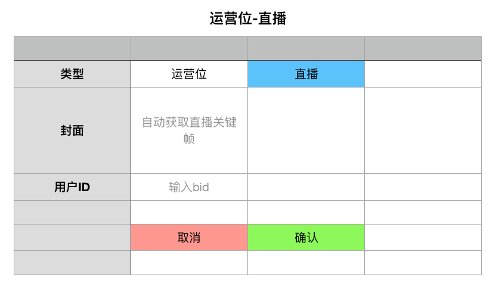

### 功能概述
* 在超玩首页显示的图片运营位、直播实况
* 可以设置4个直播
* 最多5个显示项：运营位+直播
* 直播：跳转到对应bid的超玩详情页
* 运营位：跳转到超玩详情页、webview

### 原型

列表
---

新增&编辑信息
---

### 1. 显示逻辑

#### 1.1 显示数量和优先级
* 由 直播+运营位 组成
* 最多显示5个
* 显示优先级：直播 > 运营位
	* Ex1
		* 现在3个运营位，显示位置分别为：1、2、3
		* 添加1个直播后，直播的显示位置为：1
		* 运营位的位置依次后移
	* Ex2
		* 现在有5个运营位，显示位置分别为：1、2、3、4、5
		* 添加1个直播后，直播的显示位置为：1
		* 原来位置的运营位会被替换
		* 则最终显示为：1（直播）、2（运营位）、3、4、5
		* 最早发布的运营位，将会被优先替换
* 直播，最多显示4个

#### 1.2 运营位
* 支持跳转超玩详情、webview

#### 1.3 直播
* 输入用户BID进行关联
* 获取当前直播间的关键帧作为封面
* 由于直播不能保证一直直播中，可以设置大于5个的直播，按开播时间降序，取正在直播的
* 直播画质默认为标清