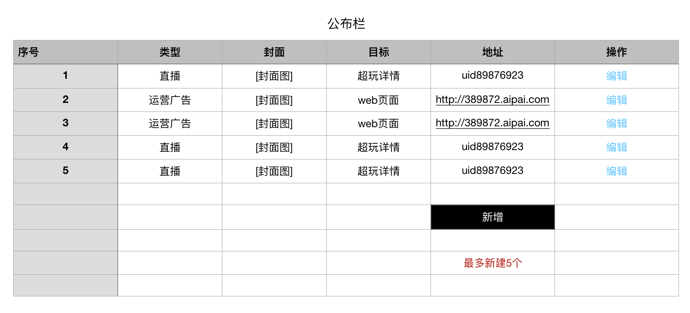
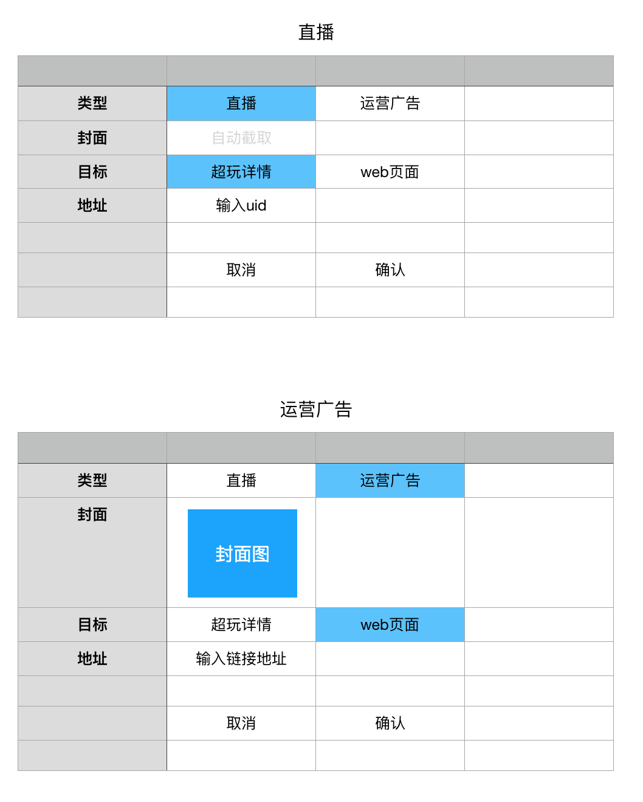

### 功能概述
* 在超玩首页显示的图片运营位、直播实况
* 可以设置3个运营广告
* 最多5个显示项：运营位+直播
* 支持的打开方式：webview、某超玩详情页

### 原型

列表
---

新增&编辑信息
---

### 1. 显示逻辑
优先级

* 运营广告
* 直播实况

### 2. 运营广告的配置
最多设置3个

配置内容为

* 封面图
* 链接
	* webview
	* 打开超玩详情页：拍子号

直播

缺原型：设置运营广告的页面

### 3. 直播实况

默认的自动规则

* 在 订单状态为沟通阶段、进行中，且有在推流的超玩 中，随机抽取

手动规则

* 输入拍子号，优先显示，前提是：在 订单状态为沟通阶段、进行中，且有在推流的超玩 中