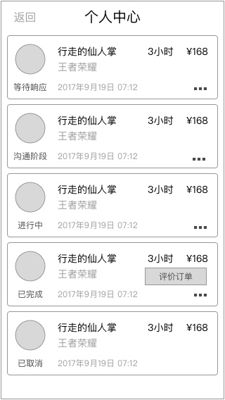

### 功能概述
* 进入个人中心的入口
* 用户、超玩看到的入口样式会不一样
* 进入的页面也不一样

### 原型

用户看到的入口
---

用户的个人中心
---

功能详见 [个人中心-用户](index-my-user.md)

超玩看到的入口
---

超玩改变接单状态时，入口的标示也会跟随改变，如 **`服务中`** 改成 **`休息`**

超玩的个人中心
---

功能详见 [个人中心-超玩](index-my-xplayer.md)

