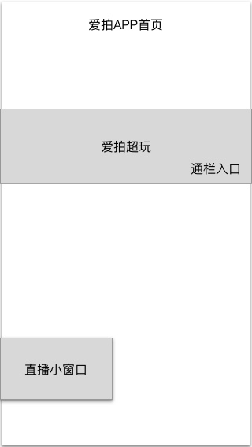

### 功能概述
通过2种方式进入

* APP首页-通栏入口
* APP首页-直播小窗口

### 原型

### 1. APP首页-通栏入口
图片形式的通栏运营位

* 在后台配置展示图
* 点击进入超玩列表

### 2. APP首页-直播小窗口
直播形式的运营位

* 在运营后台配置，悬浮在首页的小窗口直播
* 可以在后台设置多个直播房间ID，但每次只会随机显示一个开播中的
* 没有开播的，则不显示
* 载入后自动播放，用户将视频按住向左划，可以关闭它
* 只在启动app时显示
