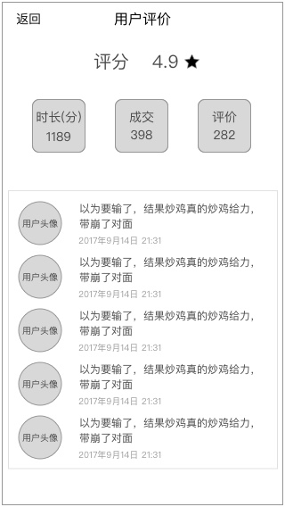
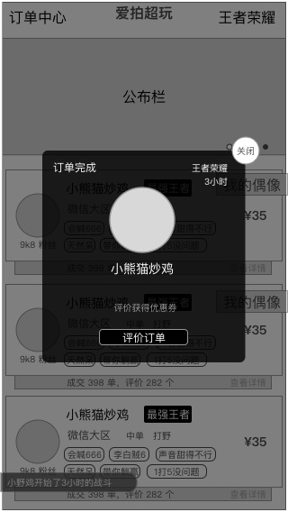

### 功能概述
* 交易结束后，用户对超玩的评价
* 超玩对用户的互评，不在v1.0实现
* 评价的形式为留言
* 不评价时默认为好评
* 只能在12小时内进行评价，超时后默认好评

### 原型

评价列表

	这里显示的评分是平均评分

### 1. 进行评价
在交易完成时，会显示评价页

#### 1.1 评分
5星的方式评分

在v1.0版本里，除了在评价页，评价列表，不会显示评分

**在评价列表里的评分，是取平均值后的结果，保留小数后一位**

#### 1.2 留言

最多输入60字的文字留言，可以输入emoji

输入框tips：还要再打一局

#### 1.3 我要申诉

弹出客服的联系方式，让用户联系，提交申诉内容

### 2. 默认好评
用户关闭评价页，24小时后，自动给予默认好评
需要准备文案

