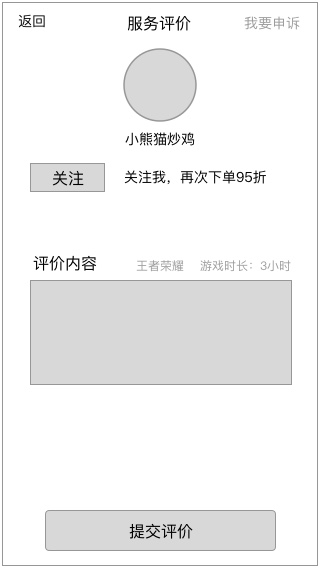

### 功能概述
* 交易结束后，用户对超玩的评价
* 超玩对用户的互评，不在v1.0实现
* 评价的形式为留言
* 不评价时默认为好评
* 只能在12小时内进行评价，超时后默认好评

### 原型

评价列表

### 1. 进行评价
在订单结束后，会显示评价页
目前支持的评价方式

* 留言

最多输入60字的文字留言，可以输入emoji

输入框tips：还要再打一局

* 我要申诉

弹出客服的联系方式，让用户联系，提交申诉内容

### 2. 默认好评
设定随机好评的文案，超时后自动好评
（文案待定

