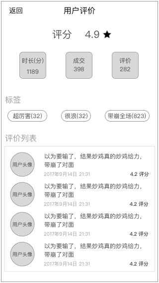
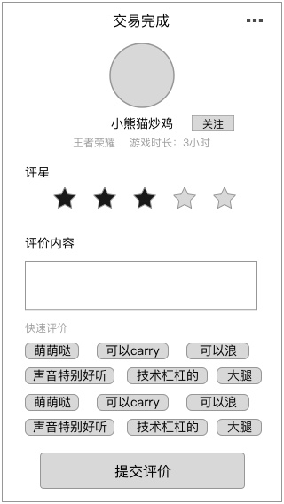

### 功能概述
* 交易结束后，用户对超玩的评价
* 超玩对用户的互评，不在v1.0实现
* 评价的形式为留言
* 用户在评价时选择的标签，会统计出来，标签本身没有行为，仅有统计数字。在后续版本会考虑点击标签筛选评论
* 不评价时默认为好评
* 评价时杀死应用，视为默认好评，下次启动应用时不会再弹出该条
* 只能在12小时内进行评价，超时后默认好评

### 原型

评价列表

显示评价时，标签的使用次数，和运营后台看到的数字一致

	这里显示的评分是平均评分

### 1. 进行评价
在交易完成时，会显示评价页

#### 1.1 评分
最大5颗星的方式评分

**在评价列表里的评分，是取平均值后的结果，保留小数后一位**

	评分、评价，至少2选1才能提交

#### 1.2 评价内容

	评分、评价，至少2选1才能提交

##### 1.2.1 输入评价

* 可以输入最多60字的文字留言，可以输入emoji

##### 1.2.2 快速评价

* 选择最多8个快捷评论的标签
* **选择的标签不会填写到评价内容里**
* 后台统计标签被使用的次数

#### 1.3 我要申诉
* 在页面右上角的 `更多` 展开后显示 `我要申诉`按钮
* 弹出客服的联系方式，让用户联系，提交申诉内容

### 2. 默认评价
当用户只评星，没评价时，自动根据星数给出默认评价

* 1：[空]
* 2：[空]
* 3：下次再来一起玩啊
* 4：实力大腿，一直在带飞
* 5：下次一定找你哦

在这里配置 [评价内容](evaluate-quickreplylist.md)

