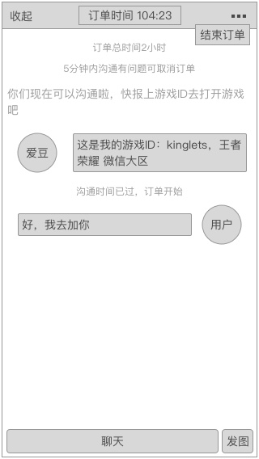
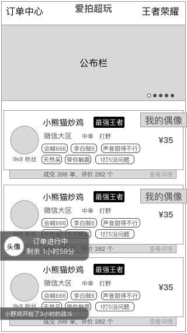
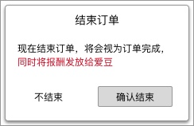
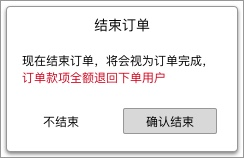

### 功能概述
* 在IM中进行
* 在沟通阶段，用户双方都可以 结束订单
* 沟通阶段开始、结束时，会有提示
* 用户、超玩看到的页面，出了聊天对象不一样，其他一样，之后会差异化布局
* 上一个阶段 [沟通阶段](order-communicate.md)
* 下一个阶段 [订单完成](order-finished.md)

### 原型
进行中
---

IM收起后的状态
---

### 系统提示语
该部分信息由系统发出，主要用于进程的提醒，高频信息的展示

提示语会有多个样式，设计图中需要提现

* 订单开始
	* 红色
* 沟通时间到达
	* 红色
* 沟通提示语
	* 灰色
* 将超玩的游戏大区、ID发出来，方便用户添加
	* 用户对话样式

### 订单开始的操作
右上角的 **`更多`** 按钮里，出现的是 **`结束订单`**

用户结束订单
---

超玩结束订单
---

* 双方都可以发起
* 发起时有确认窗
* 用户发起时，结束订单，并且将款项给到超玩
	* 系统推送文案
		* 对超玩：用户发起了提前结束，订单已顺利完成，收益已到账！
* 超玩发起时，本次订单不收取费用，系统全额退给用户
	* 系统推送文案
		* 对用户：超玩发起了提前结束，订单已顺利完成，本次订单免费，已支付费用将原路退回！

# 下一阶段 [订单完成](order-finished.md)