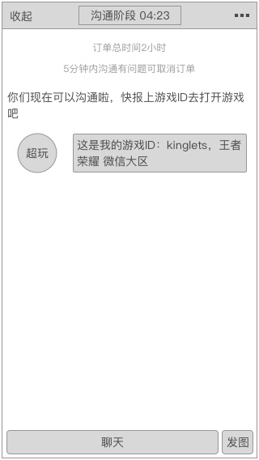

### 功能概述
* 进入该界面，表示交易已在进行中，和交易状态关联
* 每次只跟当前订单的超玩进入IM
* 最多同时存在1个IM
* 聊天系统，简称IM，可以收起，回到爱拍app内
* 收起的IM，会显示订单的进行中
* 使用爱拍自身的聊天系统，只支持发文字、图片
* 订单完成后，IM关闭，用户不能再次进入，直到新订单开始

### 原型
沟通阶段
---

订单开始
---

订单开始，IM收起
---

### 系统提示语
该部分信息由系统发出，主要用于进程的提醒，高频信息的展示

提示语会有多个样式，设计图中需要提现

* 订单开始
	* 红色
* 沟通时间到达
	* 红色
* 沟通提示语
	* 灰色
* 将超玩的游戏大区、ID发出来，方便用户添加
	* 用户对话样式

### 沟通阶段
右上角的 **`更多`** 按钮里，出现的是 **`取消订单`**

* 双方都可以发起
* 发起时有确认窗
* 每天有次数限制

### 订单开始
右上角的 **`更多`** 按钮里，出现的是 **`结束订单`**

* 双方都可以发起
* 发起时有确认窗
* 用户发起时，结束订单，并且将款项给到超玩
* 超玩发起时，本次订单不收取费用，系统全额退给用户