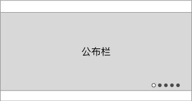

### 功能概述
* 展示 运营位、直播实况 的轮播图
* 直播实况优于运营位显示
* 不会自动滚动

### 1. 原型

### 2. 显示逻辑
1. 运营位，如果后台有设置，则轮播图一定显示其内容，后台必须设定1个内容
2. 直播实况，如果后台有设置，则轮播图一定显示其内容，没有则不显示，组多显示3个直播
3. 如果同时设置，则优先显示直播实况，例如：有3个直播实况在播，则序号1、2、3都是直播实况，4是运营位
4. 进入页面时，若当前轮播图是直播实况，会开始自动播放，只出现视频，不会出现直播间的弹幕、送礼等功能
5. 滑动可切换，系统断开上一个直播，播放当前轮播图的直播
