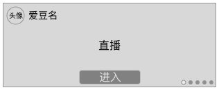
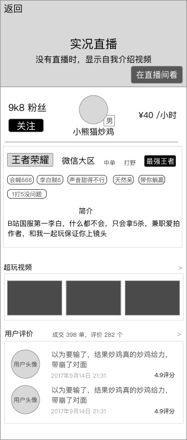

### 功能概述
* 展示 运营位、直播实况 的轮播图
* 直播实况优于运营位显示
* 不会自动滚动

### 原型
显示公告时
---

显示直播时
---

### 显示逻辑
排列优先级：运营位 > 直播

1. 运营位
	* 如果后台有设置，则轮播图一定显示其内容，后台必须设定1个内容
	* 固定一个位置为 `成为超玩` 的入口
	* 运营位最多3个
2. 直播
	* 如果后台有设置，则轮播图显示其内容，没有则不显示，最多显示3个直播
	* 进入页面时，若当前轮播图是直播实况，会开始自动播放，只出现视频，不会出现直播间的弹幕、送礼等功能
	* 超玩的订单状态是 **`沟通阶段`**、**`进行中`**，同时进行推流，会在超玩详情里出现直播实况
	* 除此以外，即使有推流，也不会出现在直播实况里播出
	* 点击 `进入`，进入 [超玩详情](xplayer-info.md)
	* 
3. 如果同时设置，则优先显示直播实况，例如：有3个直播实况在播，则序号1、2、3都是直播实况，4是运营位
4. 滑动可切换，系统断开上一个直播，播放当前轮播图的直播
