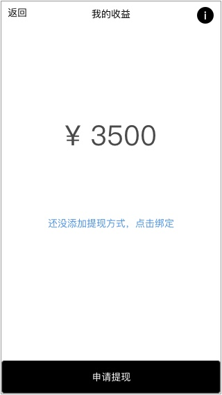
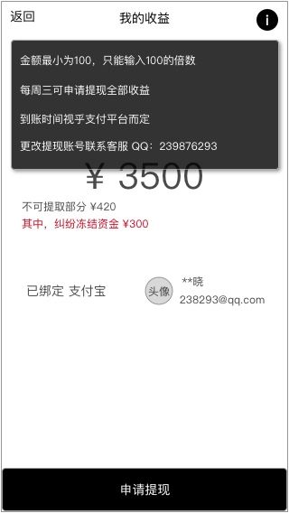
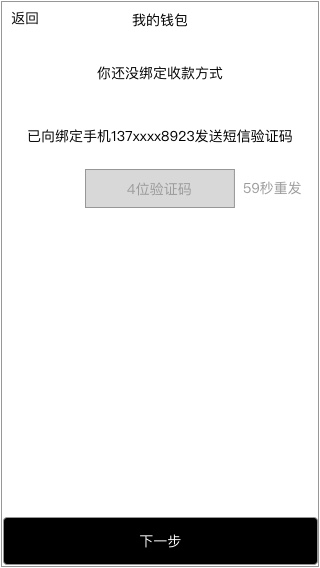
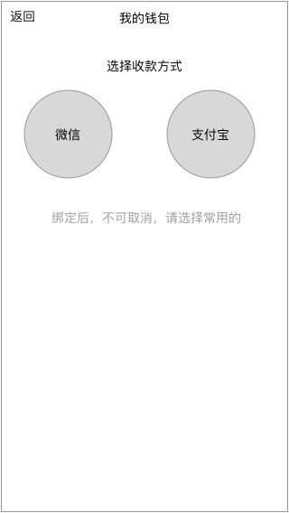

### 功能概述
* 用户存放报酬的地方
* 每周三可申请提现上周及之前的
* 从 个人中心-超玩 进入

### 原型
未绑定
---

* 依然显示用户的收益金额
* 提现需要绑定提现方式，目前支持支付宝

已绑定
---

* 右上角的icon可以点击
* toast显示帮助信息

已申请
---

* 已申请时，显示提示
* `申请提现`按钮不可用，直到申请有结果

### 1. 绑定收款方式

#### 1.1 未绑定时

超链接tips：还没绑定提现方式

点击后，进入 **绑定流程**

点击 **`申请提现`** 判断用户是否绑定收款方式，未绑定时，进入 **绑定流程**

#### 1.2 绑定流程

基于安全考虑，初次使用需要验证该爱拍账号绑定的手机号

分2步进行的提示界面

##### 1.2.1 第一步验证手机
---

用户收到短信验证码

	3892 【超级玩家】验证码

##### 1.2.2 第二步，选择绑定的收款方式
---

* 点击后，跳转到第三方应用授权
* 授权成功后，回到 我的钱包 页面
* 显示已绑定的标记

### 2. 提现规则
* 下周三可提取上周及之前的收入
* 最低100，最高视乎钱包数额
* **若有用户投诉的订单在处理中，对应的资金会被冻结，无法提现**
* 用户点击后，将提现的申请提交到后台

#### 2.1 提现状态

* 可提现
	* `申请提现`按钮可用
* 已申请提现
	* `申请提现`按钮不可用
	* 出现tips提现提示：xx年xx月xx日 申请提现 ¥xx
	* 直到审核完成

#### 2.2 因订单纠纷而冻结资金

* 如有订单发生纠纷，会暂定冻结该订单的资金
* 出现提示
* 冻结资金包含在不可提取部分里
* 后台可对订单操作，令其进入 `申诉中` 状态

### 3. tips提现帮助
* 点击在页面右上角的icon展开
* toast显示帮助文案

再次点击屏幕收起