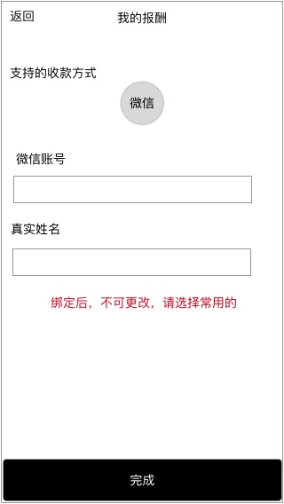

### 功能概述
* 用户存放报酬的地方
* 下周三可提取上周或更前的收益
* 从 个人中心-超玩 进入

### 原型

### 1. 绑定收款方式

#### 1.1 未绑定时

显示标记：绑定收款方式，点击后，进入 **绑定流程**

点击 **`提现`** 判断用户是否绑定收款方式，未绑定时，进入 **绑定流程**

#### 1.2 绑定流程

基于安全考虑，初次使用需要验证该爱拍账号绑定的手机号

分2步进行的提示界面

##### 1.2.1 第一步验证手机
---

##### 1.2.2 第二步，选择绑定的收款方式
---

* 点击后，跳转到第三方应用授权
* 授权成功后，回到 我的钱包 页面
* 显示已绑定的标记

### 2. 提现规则
* 下周三可提取上周之前的收入
* 最低100，最高视乎钱包数额
* **若有用户投诉的订单在处理中，对应的资金会被冻结，无法提现**
* 用户点击后，将提现的申请提交到后台

#### 2.1 提现状态

* 可提现
	* 可提交提现请求
* 等待审核中
	* 不可提交提现请求
	* “提现“按钮出现文字提示“等待审核中”
	* 直到审核完成

#### 2.2 资金冻结

* 如有订单发生纠纷，会暂定冻结该订单的资金
* 出现提示