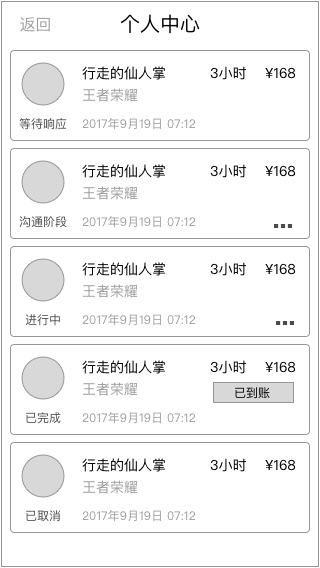
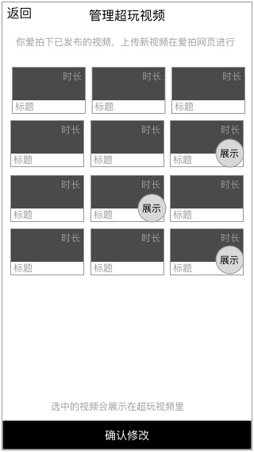

### 功能概述
* 超玩的个人中心，功能与一般用户有很大区别
* 里面是一个功能集合
* 切换接单状态在这里切换

### 原型

### 1. 接单状态
超玩手动切换接单状态

* 休息
* 服务中

切换接单状态后，会反映在入口上

了解 [接单状态](order-xplayer-state.md)

### 2. 服务价格

* 修改服务价格，滚轮选择
* 默认价格是：¥ 25/小时
* 最小是：5元/小时
* 最大是：200/小时
* 每天只能修改一次
* 超过此数后点击，tips提示：每天只能修改一次

`保存` 后生效

### 3. 我的收益

用于存放超玩的资金，可以提现

* 下周的周三可提现上周之前的收入
* 最少提取 100元
* 只能提取100的整数倍

提现时的绑定支付方式，需要验证手机号

功能详见，[我的收益](index-my-xplayer-wallet.md)

### 4. 我的订单

功能详见，[我的订单-超玩](order-list.md)

### 5. 修改资料

功能详见，[修改资料-超玩](xplayer-info-edit.md)

### 6. 管理超玩视频

功能详见，[管理超玩视频](idol-video-manage.md)

### 7. 设置自我介绍视频

功能详见，[设置自我介绍视频](introducevideo-setting.md)

### 8. 消息

有未读消息时，会有小红点

功能详见。[消息](message.md)

### 9. 帮助
运营为用户提供帮助内容的h5页面，目前有

* 如何开启直播
* 如何设置自我介绍视频

