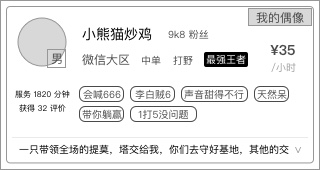

### 功能概述
* 展示超玩的列表
* 列表数据有呈现规则

### 1. 原型

### 2. 列表规则
1. 只展示“可接单”状态的超玩
2. “忙碌中”的超玩，会被排除出列表

然后按照优先级分段排列

#### 优先级1
	若超玩是用户在爱拍关注的，则排在列表的顶部，异性优先，然后随机排列
#### 优先级2
	双方在爱拍超玩进行过交易
#### 优先级3
	接单数量+评价数量的和，降序排列

### 3. 超玩从“忙碌中”切换为“可接单”状态
* 超玩在订单结束后，系统会自动将他的状态从“忙碌中”切换为“可接单 
* 此时，重新加入展示队列中，按规则排列
* 用户下拉页面刷新列表，向上滑列表的家在行为，会获取这些重新展示队列的超玩数据，但必须严格符合列表规则