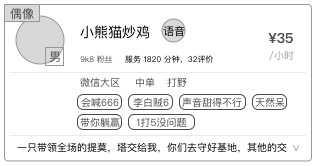
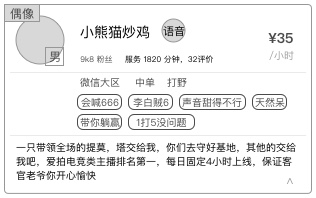

### 功能概述
* 展示超玩的列表
* 列表数据有呈现规则
* 超玩列表只会显示通过该游戏认证的服务中的超玩
* 下拉刷新页面重新获取数据，1次获取12条数据
* 页面不会自动刷新

### 1. 原型

### 2. 可展开、收起简介

* 点击项目的下方水平位置，展开简介
* 再次点击，收起

### 3. 列表规则

1. 属于当前所选游戏的超玩
2. 接单状态为“服务中”
3. “忙碌中”的超玩，会被排除出列表

然后按照优先级分段排列，**如有多个，随机排列**

#### 优先级1
	是偶像，且和用户进行过交易

#### 优先级2
	若超玩是用户在爱拍关注的，则排在列表的顶部，异性优先
#### 优先级3
	双方在爱拍超玩进行过交易，不添加额外标记
#### 优先级4
	有和其他用户发生过交易
#### 优先级5
	随机排列

### 4. 超玩从“忙碌中”切换为“服务中”状态
* 超玩在订单结束后，系统会自动将他的状态从“忙碌中”切换为“服务中“ 
* 此时，重新加入展示队列中，按规则排列
* 下拉刷新页面重新获取数据
* 向上滑列表的用户行为，会获取列表中，这些重新加入的超玩数据，但必须严格符合列表规则