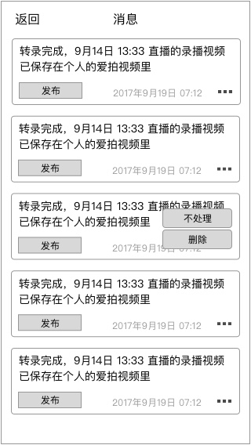

### 功能概述
* 该功能只有超玩可见
* 主要用于处理转录完成的消息

### 原型
入口在个人中心
---

**有未读消息时，有小红点**

消息列表
---

转录完成后，通过 `系统推送` 告知用户，点击后，进入该页面

### 1. 转录视频的信息
系统自动添加必要的视频信息

##### 1.1. 视频名字
名字生成规则：和 [直播间名字] + [开播时间]
如产生分段，在后面名字后添加：-[PartN]

例如：

* 小鼠的直播间12点11分
* 小鼠的直播间12点11分-part1

##### 1.2. 视频标签
为视频添加标签 “超玩”

### 2. 对消息的操作

此时，**视频已经在用户的爱拍视频里，私有状态**

按钮对应功能

* 发布
	* 发布到爱拍，同时关联为超玩视频
	* 同时在消息中心删除这条消息
* 不处理
	* 删除这条消息
* 删除这个视频
	* 从爱拍视频中删除
	* 同时在消息中心删除这条消息

