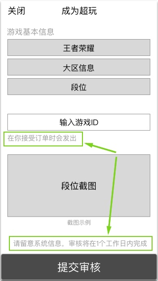
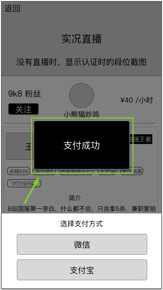
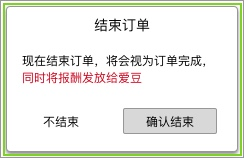
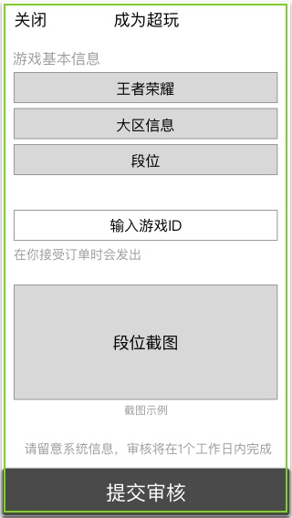

### 功能概述
* 将使用到的用户通知形式统一
* 主要针对美术上，同一个类型有多种风格的情况
* 设计需要给出统一的美术标准，技术调用，不允许同一类型和出现和约定样式不同的情况
* 若遇到标准模糊的情况，推荐使用系统原生控件，iOS、android可以分开，减少实现成本

### 类型列表{#top}
从轻到强排列

1. [提示tips](#1)
2. [浮层toast](#2)
3. [确认框alert](#3)
4. [弹窗modal](#4)
5. [推送](#5)
6. [短信](#6)
7. [强推送](#7)

---

#### 1. 提示tips{#1}
* 弱通知
* 字体颜色建议使用不吸引注意力的灰色
* 通常在间隙的UI位置添加，类似备注
* 一般不能点击
* 也可以添加超链接，字体颜色变成蓝色，表示可点击和跳转

[返回类型列表](#top)

#### 2. 浮层toast{#2}
* 弱通知
* 3秒后渐出。实际时长会有差异
* 无交互行为
* 大小会根据文字长度改变

[返回类型列表](#top)

#### 3. 确认框alert{#3}
* 强通知
* 直到用户响应才会消失
* 一般用于需要二次确认的情景

[返回类型列表](#top)

#### 4. 弹窗modal{#4}
* 强通知
* 全屏的弹窗，也存在半屏
* 顶部左边按钮是“关闭”，右边若有，会是“保存”之类的确认操作

[返回类型列表](#top)

#### 5. 推送{#5}
* 通过系统、sdk发送纯文字的即时推送信息到用户
* 用户在无网络时无法收到推送
* 无需美术风格

[返回类型列表](#top)

#### 6. 短信{#6}
* 通过sns运营商发送纯文字的短信
* 到达时效可能存在延迟
* 用户在无网络也可以收到短信
* 无需美术风格

[返回类型列表](#top)

#### 7. 强推送{#7}
* 用户杀死应用后，也会收到消息
* 持续播放提示音+震动，和微信发起语音通话一样
* 点击通知，进入超玩页面
	* 若进程存活，会进入到最后的页面
	* 若不存在进程，会进入到超玩列表

[返回类型列表](#top)