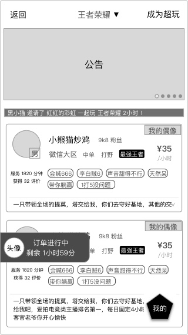

### 功能概述
* 沟通阶段在IM内进行
* 沟通阶段的时间，是系统预设的，不在购买的订单时间内，免费
* 在沟通阶段，用户双方都可以取消订单
* 沟通阶段开始、结束时，会有提示
* 用户、超玩看到的页面，出了聊天对象不一样，其他一样，之后会差异化布局
* 完整的 [订单状态的逻辑](order-logic.md)
* 上一个阶段是 [等待响应](order-new.md)
* 下一个阶段时 [开始订单](im.md)

### 原型
沟通阶段
---

IM收起后的状态
---

### 系统提示语
该部分信息由系统发出，主要用于进程的提醒，高频信息的展示

提示语会有多个样式，设计图中需要提现

* 订单开始
	* 红色
* 沟通时间到达
	* 红色
* 沟通提示语
	* 灰色
* 将超玩的游戏大区、ID发出来，方便用户添加
	* 用户对话样式

### 沟通阶段的操作

右上角的 **`更多`** 按钮里，出现的是 **`取消订单`**

* 双方都可以发起
* 发起时有确认窗
* 每天有次数限制

# 下一个阶段 [订单开始](im.md)