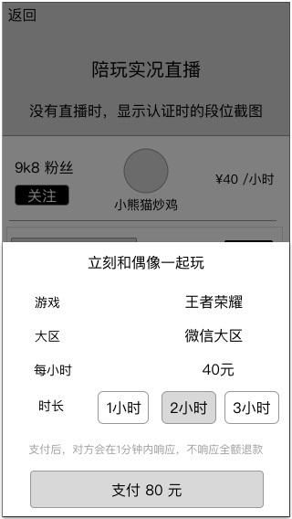
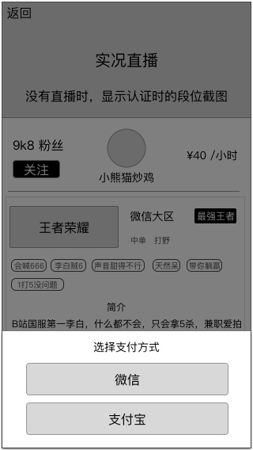
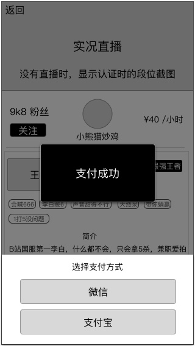

### 功能概述爱豆
* 用户对爱豆下单
* 非服务中状态的爱豆，也视为用户，可对爱豆下单
* 同一时间，用户只可以对一位爱豆下单
* 直到订单被拒、订单完成，才可以重新下单
* 完整的 [订单状态的逻辑](order-logic.md)
* 下一个阶段是：[等待响应](order-new.md)

### 原型
下单界面
---

选择支付方式
---

### 支付
* 点击支付时，弹出支付方式，默认使用支付宝，可手动选择
* 支付成功后，才创建订单，开启双方的IM
* 支付失败不在该页面反馈，交给第三方支付平台去显示
* 点击非弹出部分，返回，取消支付

### 支付成功

# **下一个阶段 [等待响应](order-new.md)**