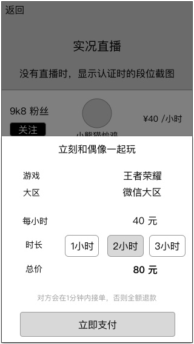
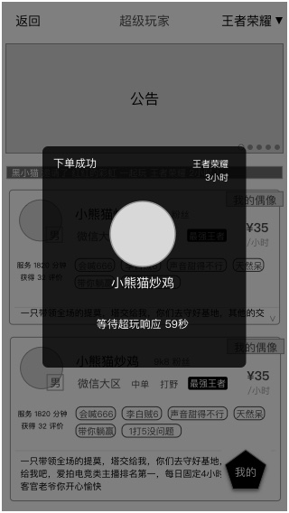

### 功能概述
* 用户对超玩下单
* 非服务中状态的超玩，也视为用户，可对超玩下单
* 同一时间，用户只可以对一位超玩下单
* 直到订单被拒、订单完成，才可以重新下单
* 关于 [订单状态](order-state.md) 的规则

### 原型

选择支付方式

### 支付
* 点击支付时，弹出支付方式，默认使用支付宝，可手动选择
* 支付成功后，才创建订单，开启双方的IM
* 支付失败不在该页面反馈，交给第三方支付平台去显示
* 点击非弹出部分，返回，取消支付

### 下单成功
同时满足以下条件

* 支付成功
* 超玩的接单状态处于 服务中

用户可在时限内取消订单，了解详细的[订单状态](app/order-state.md)

	直到订单响应前，除了点取消订单，不能关闭

弹窗提示：等待超玩响应，60秒倒计时