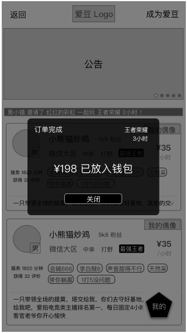

### 功能概述
* 订单到达时限后，系统推送+应用内弹窗通知双方
* 关闭IM入口

### 原型

用户的弹窗，引导用户评价
---

爱豆的弹窗，点击关闭按钮可以关闭
---

### 提醒方式
用户和同时触发，推送+弹窗

对用户

* 系统推送：订单完成，快来评价获得优惠券吧
* 应用内弹窗提示

对

* 系统推送：订单完成，¥198 已放入钱包
* 应用内弹窗提示

### 状态的改变
订单完成后，用户、的状态都会发生改变

用户

* 从 忙碌中 切换到 **`可下单`**

* 从 忙碌中 切换到 **`服务中`**

### 关闭IM
订单完成的同时，IM入口关闭，用户不能再次进入