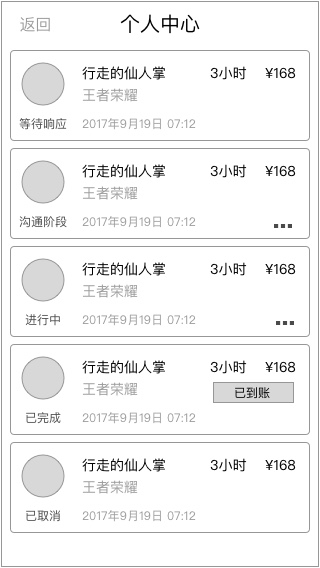

### 功能概述
* 以列表形式将订单都展示
* 订单的信息会通过排版全部展开，所以没有订单详情页
* 订单需要本地缓存，离线时也可以看到上次进入的信息

### 原型

	 在订单结束后，24小时内，会出现评价按钮

用户看到的界面，会在右上角多了一个 成为超玩 的认证入口

### 1. 订单状态的显示
对于用户，只展示部分状态，部分会带有操作

* **等待响应**
	* 对应 订单状态 等待响应
* **沟通中**
	* 系统赠送免费沟通时间，5分钟，期间可取消订单
	* 5分钟后如无取消订单，显示为进行中
* **进行中**
	* 订单状态 订单开始-5分钟后
	* 取消 `取消订单` 按钮的显示
* **完成**
	* 出现 `评价服务` 按钮
	* 出现 `更多` 按钮，点击后展开 `我要申诉` 按钮
	* 保持24小时

* **已取消**
	* 对应 订单状态 取消订单
	* 出现 `更多` 按钮，点击后展开 `我要申诉` 按钮

在v1.0暂不考虑显示 申诉中 状态，更多状态详见 [订单状态](order-state.md)

### 2. 订单时间的显示
订单时间和订单状态有对应关系

* 等待响应  ——  显示下单时间
* 进行中  ——  显示订单开始时间
* 完成  ——  显示订完完成时间
* 已取消  —— 显示订单取消时间