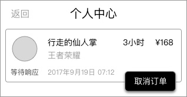
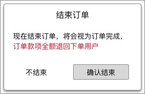

### 功能概述
* 以列表形式将订单都展示
* 订单的信息会通过排版全部展开，所以没有订单详情页
* 订单需要本地缓存，离线时也可以看到上次进入的信息
* 超玩的看到的订单功能和用户的有区别

### 原型

菜单弹出，及二次确认菜单，请见 [个人中心-用户](index-my-user.md)

### 1. 订单状态
* 不同订单状态，对应不同功能
* 同样的状态，超玩可能没有操作的功能，这是两者的区别
* 功能内藏在 `更多`（水平3点的icon） 里

#### 1.2 状态对应的功能
* 等待响应
	* 无功能
* 沟通阶段
	* 功能：取消订单
	* 进行二次确认
* 进行中
	* 功能：结束订单
	* 进行二次确认
* 已完成
	* 功能：我要申诉
	* 24小时后取消显示
* 已取消
	* 无功能

### 2. 订单时间的显示
订单时间和订单状态有对应关系

* 等待响应  ——  显示 支付成功 时间
* 进行中  ——  显示 订单开始 时间
* 已完成  ——  显示 订单完成 时间
* 已取消  —— 显示 订单取消 时间