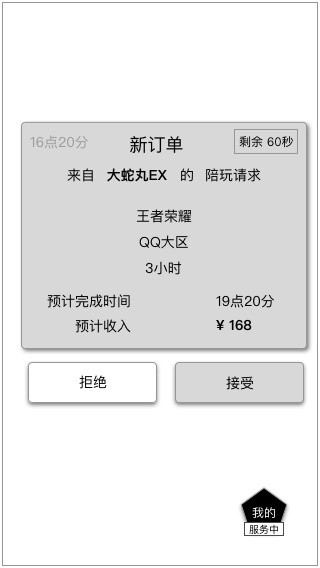
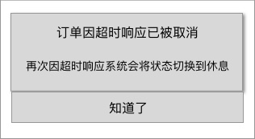

### 功能概述
* 用户已提交的订单，在订单中心可以查看到
* 超玩接受、拒接的订单，都会出现在订单中心里
* 超玩服务中，收到新订单时，会有弹窗提醒

### 原型

### 对新订单的响应逻辑
1. 60秒内，超玩不相应，默认为不接受
	* 连续发生2次后，系统将超玩的接单状态自动设置为“休息”
	* 

2. 超玩点击“马上开始”，即为接受订单
	* 订单开始，双方进入IM，开始沟通，详见 [聊天系统](app/im.md)
3. 超玩点击“不接受”，视为拒绝订单
	* 当天频繁拒绝订单，会降低在列表的展示优先级
	* 甚至警告

