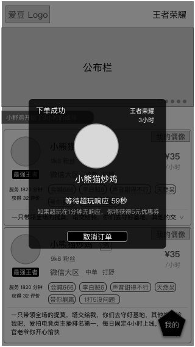
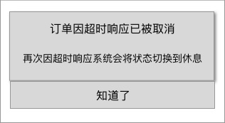

### 功能概述
* 用户已提交的订单，在订单中心可以查看到
* 超玩接受、拒接的订单，都会出现在订单中心里
* 超玩服务中，收到新订单时，会有弹窗提醒
* 完整的 [订单状态的逻辑](order-logic.md)
* 上一个阶段是 [下单阶段](order-create.md)
* 下一个阶段是 [沟通阶段](order-communicate.md)

### 原型

支付成功后，用户 会来到这个页面，等待超玩响应
---

同时，超玩收到强通知 有新订单，需要在限时内响应
---

### 1. 超玩收到新订单的通知
采用强通知的方式

#### 1.1 在应用内
* 播放1次提示音
* 弹出新订单的提示页

#### 1.2 不在应用内
* 应用被杀死，也被视为不在应用内
* 播放1次提示音
* 持续震动
* 系统推送文案
	* 对超玩：你有新订单，请在时限内处理！

### 2. 超玩对新订单的响应逻辑
#### 2.1 60秒内，超玩不相应，默认为不接受
* 连续发生2次后，系统将超玩的接单状态自动设置为“休息”
* 

#### 2.2 超玩点击“马上开始”，即为接受订单
* 订单开始，双方进入IM，开始沟通
* 
* 详见 [沟通阶段](im.md)

#### 2.3 超玩点击“不接受”，视为拒绝订单
* 当天手动拒单超过3次，会将超玩的接单状态切换到冻结，直到次日0点

# 下一个阶段 [沟通阶段](order-communicate.md)