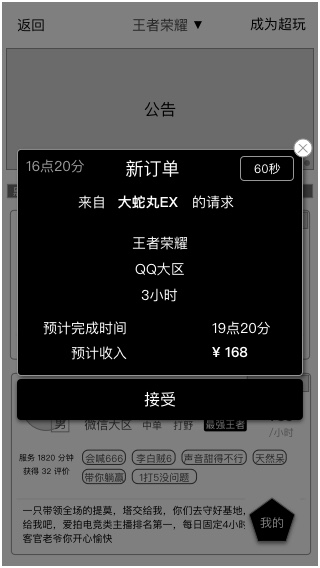
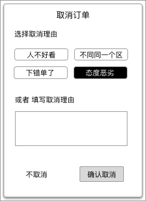

### 功能概述
* 用户已提交的订单，在订单中心可以查看到
* 超玩接受、拒接的订单，都会出现在订单中心里
* 超玩服务中，收到新订单时，会有弹窗提醒
* 完整的 [订单状态的逻辑](order-logic.md)
* 上一个阶段是 [下单阶段](order-create.md)
* 下一个阶段是 [沟通阶段](order-communicate.md)

### 原型

支付成功后，用户 会来到这个页面，等待超玩响应
---

同时，超玩收到强通知 有新订单，需要在限时内响应
---

### 超玩对新订单的响应逻辑
1. 60秒内，超玩不相应，默认为不接受
	* 连续发生2次后，系统将超玩的接单状态自动设置为“休息”
	* 

2. 超玩点击“马上开始”，即为接受订单
	* 订单开始，双方进入IM，开始沟通
	* 
	* 详见 [沟通阶段](im.md)
3. 超玩点击“不接受”，视为拒绝订单
	* 当天手动拒单超过3次，会将超玩的接单状态切换到冻结，直到次日0点

### 用户可在等待响应区间取消订单
取消订单会有确认的弹窗

确认后，关闭等待页面

	直到订单响应前，除了点 取消订单，不能关闭

# 下一个阶段 [沟通阶段](order-communicate.md)