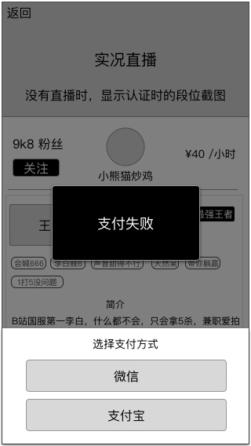

### 功能概述
* 订单在各个交易阶段，都有自己专属的状态
* 订单状态是一个持续的过程，多个状态会分别记录在每一个订单里
* 一个订单同时只会存在一个状态，之前的状态只是作为记录存在，用于数据统计
* 用户同时只能进行一个订单，直到订单结束才能开始新的另一个
* 双方可在 [我的订单](order-list.md) 看到指定的订单状态，其余用于数据统计

---

按照出现顺序排列，有以下状态

### 状态列表{#top}
1. [创建订单（用户不可见）](#1)
2. [锁定库存（用户不可见）](#lock)
3. [支付成功（用户不可见）](#2)
4. [支付失败（用户不可见）](#3)
5. [`等待响应`](#4)
6. [`沟通阶段`](#5)
7. [`进行中`](#6)
8. [主动拒绝接单（用户不可见）](#7)
9. [超时拒绝接单（用户不可见）](#8)
1. [用户主动结束（用户不可见）](#9)
11. [超玩主动结束（用户不可见）](#10)
12. [`订单已取消`](#11)
13. [`订单完成`](#12)
14. [申诉中（用户不可见，预留）](#13)

---

## 1. 创建订单{#1}
* 用户点击 `支付` 按钮的同时，系统生成订单，用于交给第三方支付平台支付
* 随后，订单状态进入 `锁定库存`

	此订单状态对用户不可见

[回到状态列表](#top)

---

## 2. 锁定库存{#lock}
视为订单的待支付状态

#### 锁定库存期间 30秒
* 超玩
	* 状态进入 `忙碌`
* 用户
	* 状态进入 `忙碌`
* 若 第三方支付平台返回 **支付成功**，则 订单状态进入`支付成功`
* 在锁定库存的时间内，用户可在第三方平台继续支付

需要支持在线修改：

	锁定库存时间 30秒

#### 超过时间后，订单状态进入 `支付失败`
* 超玩
	* 状态进入 `服务中`
* 用户
	* 状态仍然是 `忙碌`
	* **由于此时用户可能还停留在第三方支付平台，所以用户可以继续支付**
	* 订单状态进入 `支付失败`

---

## 3. 支付成功{#2}
* 用户返回超玩里，才判断支付结果
* 记录该状态的发生时间
* 用户从 第三方支付平台 返回应用后浮层toast告知用户 **支付成功**
* 随后，订单状态进入 `等待响应`
* 用户状态进入`忙碌`

	此订单状态对用户不可见

[回到状态列表](#top)

---

## 4. 支付失败{#3}
* 用户返回超玩里，才判断支付结果
* 若支付成功，则不记录支付失败的信息
* 只记录最后一次的支付失败时间，用于统计
* 订单状态进入 `订单已取消`
* 用户状态进入`可下单`

### 以下用户行为视为支付失败
* 应用内，手动离开下单页面

### 若返回后得知用户支付成功，则
* 浮层toast告知用户 **支付失败**，2秒后强制刷新页面
* 同时，将付款金额，全数即时原路退回用户
* 订单状态进入 `订单已取消`

	此订单状态对用户不可见

[回到状态列表](#top)

---

## 5. 等待响应{#4}
* 用户等待超玩响应的阶段
* 用户无可操作，只有超玩有可用操作

#### 超玩 可用操作

* `接受订单` 按钮
	* 订单状态进入 `沟通阶段`
* `拒绝订单` 按钮
	* 订单状态进入 `主动拒绝接单`
	* 当天，累计拒绝 5次 订单，强制将超玩接单状态进入 `冻结` 状态，直到次日0点，无法手动切换回 `服务中` 状态
	* 超玩 尝试切换接单状态时，浮层toast告知”**由于过多拒绝订单，今日强制进入休息状态**“
* `超时拒绝订单`
	* 超过规定时间 60秒 后，系统自动决绝订单，订单状态进入 `超时拒绝订单`
	* 连续 2次 超时拒绝订单 后，系统自动将超玩的接单状态切换到 `休息`，超玩可以手动切换为 `服务中`
	* 当天，累计 超时拒绝订单 8次 后，强制将超玩接单状态进入 `冻结` 状态，知道次日0店，无法手动切换为 `服务中` 状态
	* 超玩 尝试切换接单状态时，浮层toast告知”**由于过多拒绝订单，今日强制进入休息状态**“

需要支持在线修改：

	每日累计主动拒绝订单的次数 5次
	超时拒绝订单时间 60秒
	每日连续超时拒绝订单的次数 2次
	每日累计超时拒绝订单的次数 8次

[回到状态列表](#top)

---

## 6. 沟通阶段{#5}
* 系统赠送的时间，不计算在购买的订单时间内
* **时间暂定时5分钟，需要支持在线修改**
* 若规定时间内不发生取消订单，自动进入 `进行中` 状态

可用操作

#### 用户

* `取消订单` 按钮
* 有确认取消的警告窗
* 订单进入 订单已取消 状态

#### 超玩

* `取消订单` 按钮
* 有确认取消的警告窗
* 订单进入 订单已取消 状态

### 每日可取消订单 的次数限制
* 用户和超玩，每天只有 3次 取消订单的次数
* 超过次数后
	* 用户、超玩：无法取消订单
	* 点击 `取消订单` 按钮时，浮层toast告知 “**每天只有3次取消订单的机会**”

需要支持在线修改：

	每日取消订单的次数 3次

[回到状态列表](#top)

---

## 7. 进行中{#6}
* 订单正式开始
* 按照订单约定的时间开始倒计时
* IM内出现这个倒计时
* 倒计时结束前，若双方不发起 `结束订单`，时间达到后，订单状态进入 `订单完成`

可用操作

#### 用户

* `结束订单` 按钮
* 有确认结束的警告窗
* 随后，订单状态进入 `用户主动结束`

#### 超玩

* `结束订单` 按钮
* 有确认结束的警告窗
* 随后，订单状态进入 `超玩主动结束`

[回到状态列表](#top)

---

## 8. 拒绝接单{#7}
* 在等待阶段，超玩主动 `拒绝接单`，会进入该状态
* 记录该状态的发生时间后，订单状态进入 `订单已取消`

		此订单状态对用户不可见

[回到状态列表](#top)

---

## 9. 超时拒绝接单{#8}
* 在等待阶段，因超时没响应，会进入该状态
* 记录该状态的发生时间后，订单状态进入 `订单已取消`

		此订单状态对用户不可见

[回到状态列表](#top)

---

## 10. 用户主动结束{#9}
* 用户主动提前结束订单
* 记录该状态的发生时间后，订单状态进入 `订单完成`

		此订单状态对用户不可见

[回到状态列表](#top)

---

## 11. 超玩主动结束{#10}
* 超玩主动提前结束订单
* 记录该状态的发生时间后，订单状态进入 `订单完成`
* 表示：本次交易正常完成，但是，超玩放弃收取本次费用，在 `订单完成` 阶段，系统会将用户支付的费用全额原路退回

		此订单状态对用户不可见

[回到状态列表](#top)

---

## 12. 订单已取消{#11}
* 订单终结状态
* 用户支付失败、主动取消时会进入该状态

		根据该订单的历史状态，判断订单是否显示于 双方的订单列表里

若存在以下的历史订单状态，则不显示

* 支付失败
* 主动拒绝订单
* 超时拒绝订单

[回到状态列表](#top)

---

## 13. 订单完成{#12}
* 订单正常完成
* 系统判断用户支付的金额如何处理
* 发放报酬的系统行为在订单完成确立时进行

可用操作

#### 用户
* `我要申诉` 按钮
* 点击后，显示联系客服的方式
* v1.0里，点击 `我要申诉` 后，并不会让订单进入 `申诉中`，但需要预留订单状态

### 发放报酬（处理支付的金额）
系统自动的财务行为

#### 若历史订单状态不存在 `超玩主动结束`，则
* 扣除 平台分成部分，目前平台收取订单金额的 20%
* 剩余部分金额发放到 超玩收益账户

#### 若历史订单状态存在 `超玩主动结束`，则
* 将金额，全数原路退回给用户

需要支持在线修改：

	平台分成 20%

[回到状态列表](#top)

---

## 14. 申诉中{#13}
* 预留状态
* v1.0里，点击 `我要申诉` 后，并不会让订单进入 `申诉中`，但需要预留订单状态

[回到状态列表](#top)