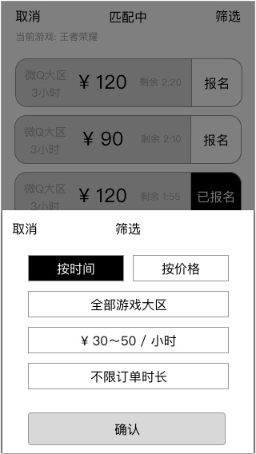
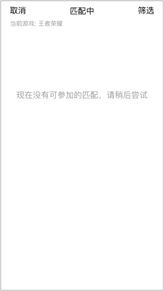

### 概述
* **只有超玩才能参加匹配**
* 超玩点击 `快速匹配`按钮 后进入

### 1. 查看可参加的匹配

#### 1.1 报名规则
* 每个超玩，有最多同时参加3个匹配的权限
* 报名后10秒，可再次点击 取消报名
* 不在列表的匹配，视为结束，将同时释放超玩的参加权限

#### 1.2 筛选列表

* 点击 `筛选` 进入
* 提供按条件筛选、排列列表

排列

* `按时间`（默认）
	* 按匹配发布时间降序排列，最近发布的越靠前
	* 若时间一样，价格高的靠前
* `按价格`
	* 按价格，升序排列
	* 若价格一样，发布时间最近的靠前

`全部游戏大区`

* 根据游戏而显示的选项
* 默认为列表的第一个选项

`单价区间`

* 低于30
* 30-50（默认）
* 55-75
* 80-120
* 120以上

`订单时长`

* 1小时（默认）
* 2小时
* 3小时

##### 交互
* 点击非筛选的UI，不会关闭
* `确认`：按照所选条件进行筛选
* `取消`：取消筛选，不改变之前的筛选

#### 1.3 列表刷新机制
* 每个匹配上都有倒计时，显示剩余的等待匹配时间
* 10秒刷新1次列表，检查匹配是否存在，同步等待匹配时间，但不会影响当前列表的位置
* 刷新后，不会重置用户的筛选条件

#### 匹配列表为空时

建议用户稍后再尝试，设计可添加轻量动画

#### 刷新当前匹配列表
在列表顶部时，下拉刷新列表，重新获取列表数据，刷新页面
