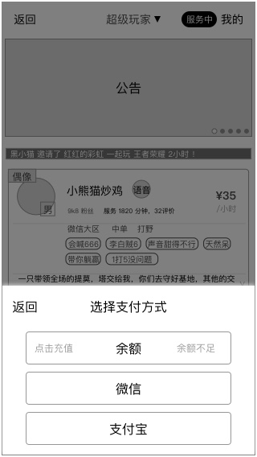

### 概述
* **用户才能发起匹配**
* 用户点击 `快速匹配`按钮 后进入
* 根据游戏，需选择的匹配信息会有差异
* 确定发起是否成功，取决于支付成功

### 1. 选择匹配信息

规则

* 当前游戏：匹配将发布的游戏，只能对应1个，读取当前游戏
* `游戏大区`：王者荣耀 才需要选择；我的世界，不需要显示
* `单价`：最低10元/小时，5为递增量，最高200
* `时长`：最低1小时，1为递增量，最高3
* `支付方式`
	* 记录用户上一次的支付方式
	* 没有选择时，默认使用余额
	* 可手动切换支付方式

**开始匹配** 按钮

* 提交支付

### 2. 提交支付

#### 2.1 若用户使用余额支付，且余额足够
* 系统在余额扣取余额后，立即进入 [等待匹配](quickstart-wait.md) ，比第三方支付快捷
* **推荐用户使用，增加推荐标示**

#### 2.2 若用户使用第三方支付
* 跳转第三方支付
* 等待第三方返回支付成功

#### 2.3 若余额不足

此时用户可选择

* 余额：进行充值
* 使用第三方支付：跳转第三方支付

##### 2.3.1 充值

功能详见 [我的钱包-充值](wallet.md)

