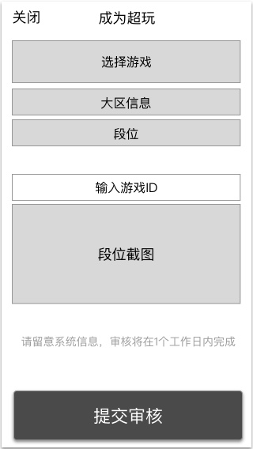

### 功能概述
* 入口在订单中心
* app自身提供上传资料的功能
* 审核在 [运营后台-审核超玩认证](verify.md) 进行

### 1. 原型

### 2. 上传的资料
* **游戏**
	* 目前有：王者荣耀、我的世界
* **对应的大区**
	* 单选
* **段位**
	* 单选
* **游戏ID**
	* 输入游戏ID，对应大区
	* 在用户沟通时，会发出，加快沟通
* **段位截图**
	* 除了游戏内部的截图
	* 也接受官方工具的截图