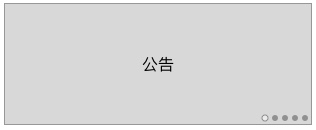
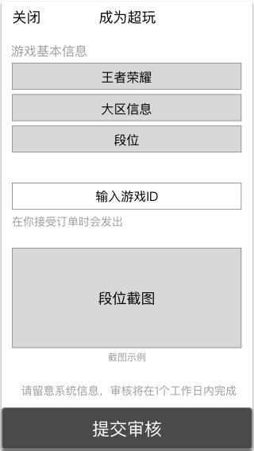
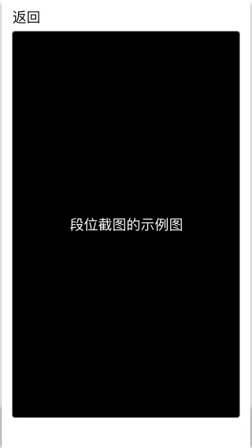

### 功能概述
* 入口在 超玩业务-首页
* app自身提供上传资料的功能
* 审核在 [运营后台-审核认证](verify.md) 进行

### 原型

入口
---

固定最后一张公布栏是 成为超玩 的入口

提交资料
---

点击 `截图示例` 时打开图片

截图示例
---

运营后台上传该截图

### 上传的资料
* **游戏**
	* 目前有：王者荣耀
* **对应的大区**
	* 单选
	* 原生控件
* **段位**
	* 单选
	* 原生控件
* **游戏ID**
	* 输入游戏ID，对应大区
	* 在用户沟通时，会发出，加快沟通
* **段位截图**
	* 除了游戏内部的截图
	* 也接受官方工具的截图