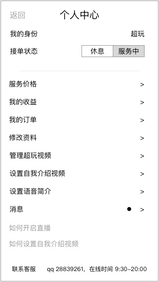
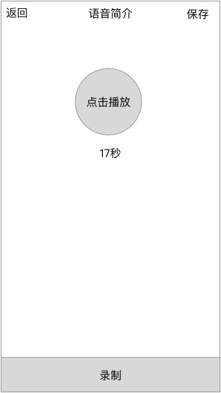
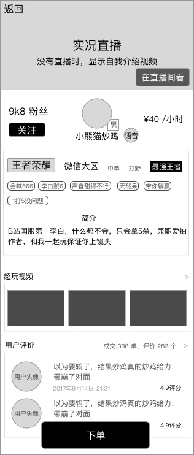

### 概述
* 提供文字简介外的介绍方式
* 语音留言在个人资料里添加
* 在超玩列表、详情，点击后直接播放

### 原型
##### 在个人中心设置语音简介

##### 录制

##### 超玩展示信息增加语音简介

### 规则

#### 播放
* 点击已经录好的语音，播放
* 不设置暂停
* 停止播放
	* 用户录制录音
	* 用户离开页面

#### 录制
* 点击 `录制` 按钮
* 最大长度为30秒
* 超过30秒，自动结束并保存
	* 录制后不保存：录制后，返回，此次录取结果不保留，调回之前的语音简介