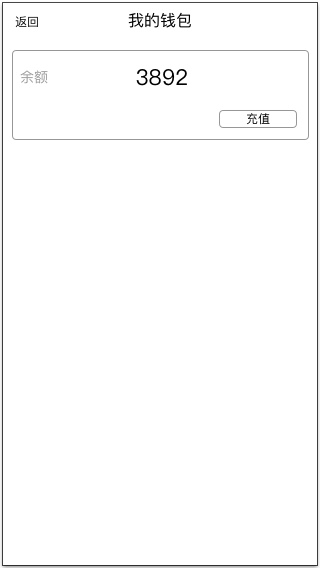
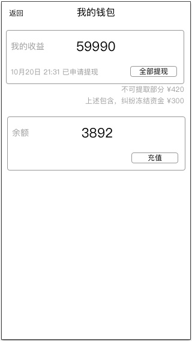
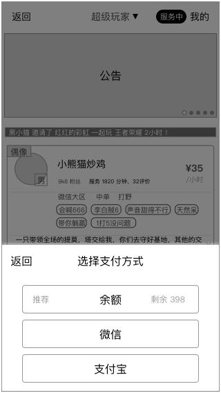
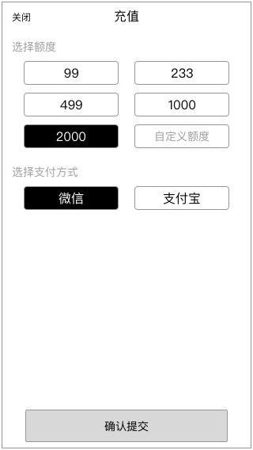
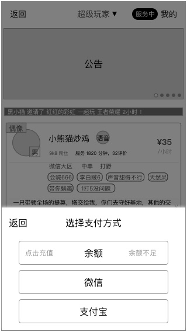

### 概述
* 支付时，优先使用余额支付
* 余额只能于支付
* 用户、超玩都有钱包
* 合并了原有的 【我的收益】
* 按身份控制模块的置顶

### 结构
* 钱包
	* 余额
		* 充值
	* 收益
		* 提现（一期功能）
		* 绑定收款方式（一期功能）

### 原型

##### 用户的钱包

##### 超玩的钱包

##### 支付时，可使用余额

##### 为余额充值

### 规则

#### 模块所属身份
余额

* 用户
* 超玩

收益

* 超玩

#### 根据身份置顶模块
根据登录账号的身份去决定模块的置顶

* 用户身份：余额
* 超玩身份：收益

#### 支付时，使用余额
* 使用条件：余额足以本次支付额
* 扣取支付额
	* 直接扣除，无需跳转其他页面
	* 若发生订单取消，订单金额原路退回到余额内

#### 余额不足
##### 余额不足时的提示

* 触发条件：在余额不足时，显示
* 用户可选择其他支付
* 若继续选择余额，则进入充值界面

#### 充值

* 支持已有额度、自定义额度
* 支持方式：微信、支付宝

若因支付时，余额不足进行充值，充值成功后

* **自动支付该笔订单，在余额里扣除对应的金额**
* 依照原支付流程进行跳转，确保支付过程流畅

##### 充值状态
* 等待第三方返回支付成功
* 支付成功
	* 校验支付状态
	* 成功
		* toast显示，充值成功
		* 同时关闭该页面
	* 失败
		* toast显示，支付失败
		* 同时刷新页面

若第三方已返回支付成功，除非服务器本身有异常，否则不会出现失败的情况