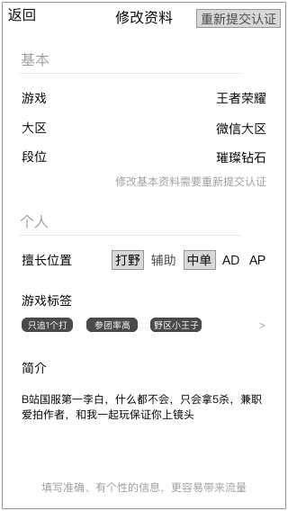
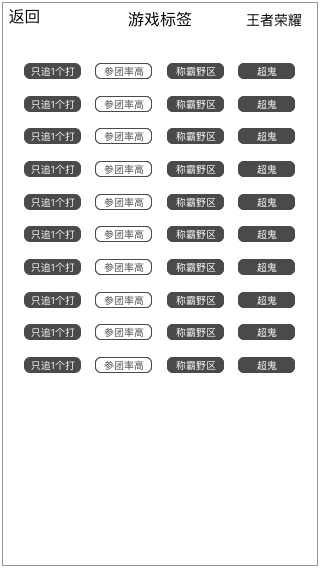

### 功能概述
* 只有爱豆才能使用的功能
* 在 个人中心-爱豆 点击 **`修改资料`**
* 结果即时保存

### 原型

### 修改逻辑
* 名字、头像不在这里提供修改入口，也不作展示，使用爱拍同样的数据
* 一个爱豆对应一个游戏，更换游戏需要重新提交认证信息
* 大区、段位、擅长位置、游戏标签的数据是在 [运营后台 - 游戏信息](console-gameinfo.md) 配置的
* 修改基本资料：重新认证
* 擅长位置：复选
* 游戏标签：复选
* 简介：点击后修改，最多填写70个字

### 编辑游戏标签
会在新页面里该游戏对应的所有游戏标签，用户复选，最多选择12个，结果即时保存

### 重新提交认证
和认证的功能一样，让用户提交认证的信息去审核，审核通过后，人工修改用户所属的游戏、大区、段位，详见 [运营后台 - 审核爱豆认证](console-verify.md)

注意事项：

* 如果用户认证过 游戏A，填写了 擅长位置、游戏标签、简介等信息
* 重新认证后，这些信息保留，不会清空
* 无论是给予现在是 游戏A 再次认证 游戏A，游戏A的擅长位置、游戏标签、简介都保留
* 还是 曾经是游戏A，现在是 游戏B，认证 游戏A，游戏A的擅长位置、游戏标签、简介都保留