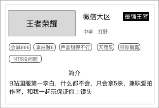

### 功能概述
* 用户选择 [运营后台-游戏信息](console/gameinfo.md) 里预设的内容
* 超玩可以拥有多份游戏信息
* 但用户在超玩列表、超玩详情每次只能看到1个游戏信息，这是因为用户每次只能查看当前所选游戏对应的超玩
* 超玩在非编辑模式，看到的内容和用户一致
* 编辑模式下，会看到已通过审核的游戏的信息

### 原型

### 1. 游戏信息-王者荣耀
* 游戏大区（用户选择
* 段位（用户选择
* 擅长位置（用户选择
* 标签（用户选择
* 简介（用户输入
* 战绩截图（审核时用的那张

详见 [运营后台-游戏信息](console/gameinfo.md)

### 2. 游戏信息-我的世界
带补充内容