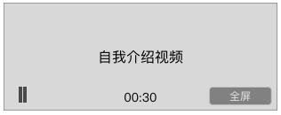
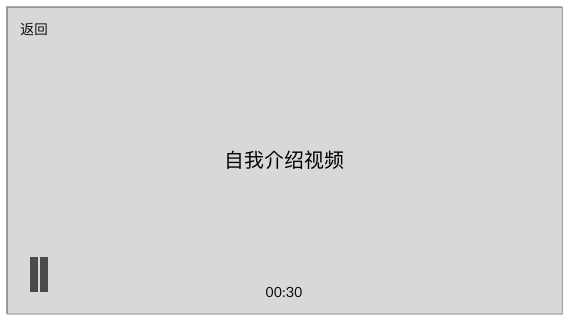

### 功能概述
* 爱豆服务中的直播画面
* 点击后进入直播间观看

### 原型
直播
---

自我介绍视频
---

* 有直播时，显示直播实况
* 没有直播时，播放用户上传的自我介绍视频
* 直播，点击进入直播间观看
* 自我介绍视频，点击播放

### 直播

* 点击播放暂停
* 没有直播间的弹幕、送礼功能和信息
* 点击 `进入直播间` 在直播间里打开

### 自我介绍视频

* 点击播放暂停
* 可以进入全屏
* 
	* `返回`，退出全屏

以游戏画面、自拍的方式介绍自己

* 时间暂定不大于30秒
* 通过爱拍pc网页去上传，打上标签“爱豆自我介绍”
* 在个人资料的编辑页，提示用户可在爱拍pc网页上传
* 自动播放

