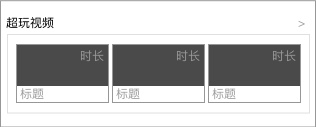
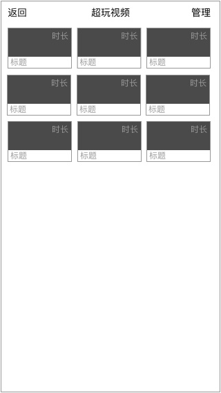
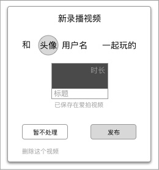
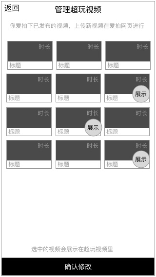

### 功能概述
* 当超玩在订单开始状态下，开启直播，关播时，会提示是否对刚才直播转录播的视频处理
* 视频会自动打上标签 “超玩”
* 本功能不提供有关视频的编辑功能，会引导用户在爱拍视频里修改

### 原型

添加箭头进入列表

只有超玩才看到 按钮 **`管理`**

### 1. 列表内容
* 只显示属于超玩的视频
* 有2种来源：直播转录播、关联爱拍视频

### 2. 来源-直播转录播

	转录完成后再通知超玩

**视频已经在用户的爱拍视频里，未发布状态**

* 发布
	* 发布到爱拍，同时关联为超玩视频
* 暂不处理
	* 不处理
* 删除这个视频
	* 从爱拍视频中删除

##### 2.1. 视频名字
名字生成规则：和 [爱拍用户名] 一起玩
如产生分段，在后面名字后添加：-[PartN]

例如：

* 和时光蓝鸟一起玩
* 和超能剪刀手一起玩-part1

##### 2.2. 视频标签
为视频添加标签 “超玩”

### 3. 来源-关联爱拍视频
点击 `管理` 按钮，进入到 个人中心的

功能详见 [管理超玩视频](idol-video-manage.md)