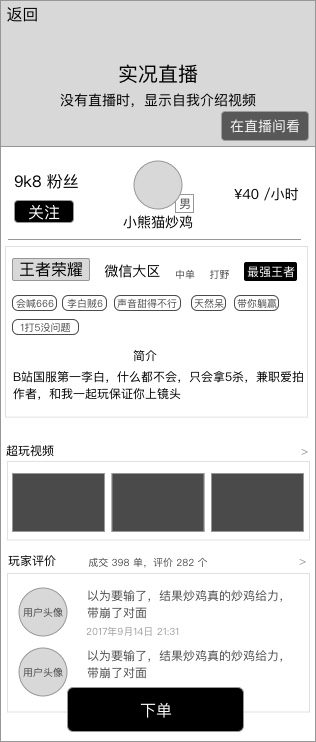
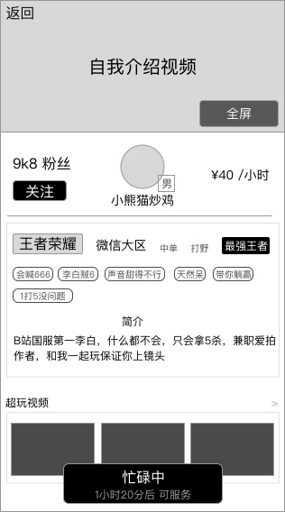
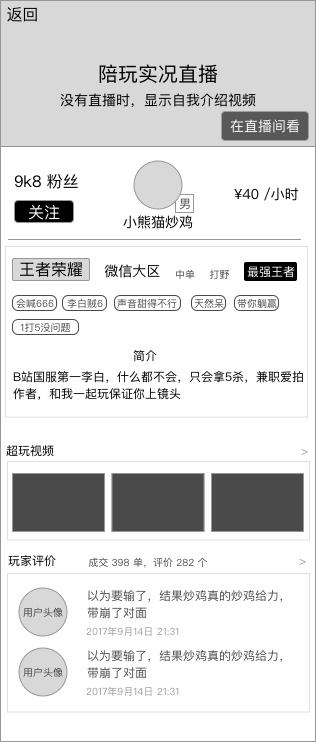
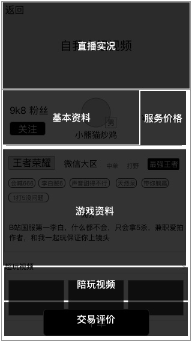

### 功能概述
* 爱豆的个人页面，不同于爱拍的个人空间
* 从爱豆业务-首页，或其他被调用的地方进入
* 只有爱豆才有详情页，一般用户是没有的
* 主要分为4类信息：基本资料、游戏信息、陪玩视频、评价

### 原型

爱豆详情-用户看到
---

爱豆详情-用户看到-忙碌时
---

爱豆详情-爱豆看自己
---

爱豆看自己，是没有 `下单` 按钮的

基于用户身份，显示有所不同

布局
---

