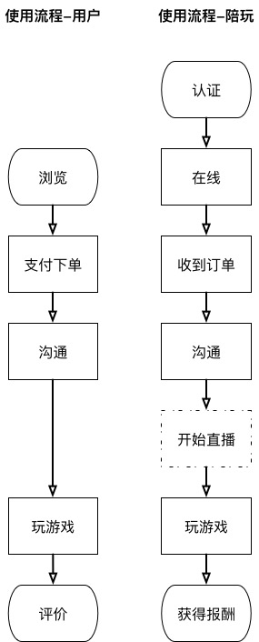

### 超级玩家-PRD

	总结为：偶像和粉丝一起玩游戏的平台

1. 为粉丝提供和作者一起玩游戏的付费方法，同时作者也能获得可见收入
2. 产生的收入用于支付直播的带宽费用，支撑直播业务
3. 行业内首创，直播陪玩过程，让其他用户感受到业务的真实性，继而使用陪玩业务，两者互相促进  

之后，打通爱拍4.0体系，借此发掘在直播上有天赋的陪玩用户。

### 使用流程
* 用户：指一般用户，不具备接单资格
* 陪玩：指经过认证的用户，可接单，对外名称为 **`超玩`**，意为超级玩家

	PRD中，没有额外说明的，都是原生页面
	
	交易过程要求实时，服务端需要保证通讯误差不大于5秒
